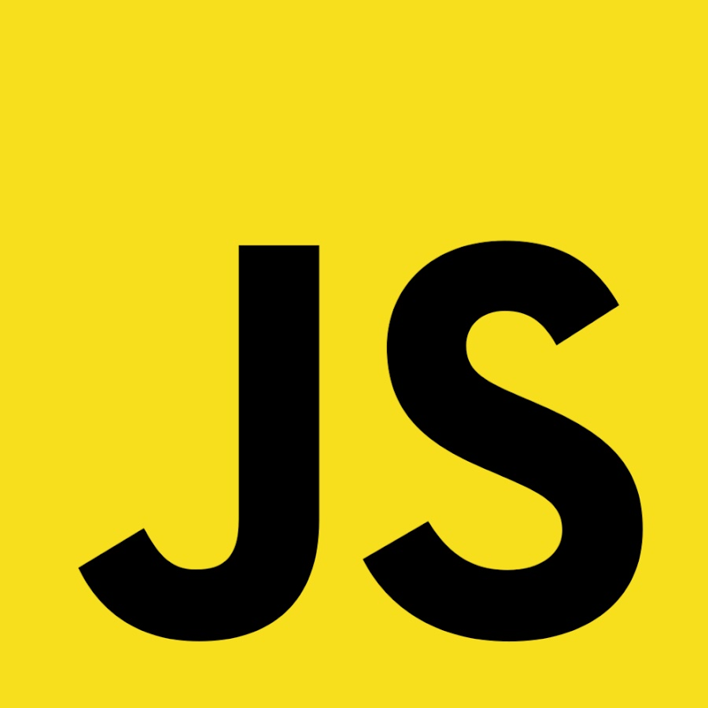

<!DOCTYPE html>
<html>
<head>
	<meta charset="utf-8">
	<meta name="viewport" content="width=device-width, initial-scale=1">
	<title>JS</title>
	<link rel="stylesheet" href="style.css">
	<link rel="apple-touch-icon" sizes="57x57" href="img/favicon/apple-icon-57x57.png">
	<link rel="apple-touch-icon" sizes="60x60" href="img/favicon/apple-icon-60x60.png">
	<link rel="apple-touch-icon" sizes="72x72" href="img/favicon/apple-icon-72x72.png">
	<link rel="apple-touch-icon" sizes="76x76" href="img/favicon/apple-icon-76x76.png">
	<link rel="apple-touch-icon" sizes="114x114" href="img/favicon/apple-icon-114x114.png">
	<link rel="apple-touch-icon" sizes="120x120" href="img/favicon/apple-icon-120x120.png">
	<link rel="apple-touch-icon" sizes="144x144" href="img/favicon/apple-icon-144x144.png">
	<link rel="apple-touch-icon" sizes="152x152" href="img/favicon/apple-icon-152x152.png">
	<link rel="apple-touch-icon" sizes="180x180" href="img/favicon/apple-icon-180x180.png">
	<link rel="icon" type="image/png" sizes="192x192"  href="img/favicon/android-icon-192x192.png">
	<link rel="icon" type="image/png" sizes="32x32" href="img/favicon/favicon-32x32.png">
	<link rel="icon" type="image/png" sizes="96x96" href="img/favicon/favicon-96x96.png">
	<link rel="icon" type="image/png" sizes="16x16" href="img/favicon/favicon-16x16.png">
	<link rel="manifest" href="img/favicon/manifest.json">
	<meta name="msapplication-TileColor" content="#ffffff">
	<meta name="msapplication-TileImage" content="img/favicon/ms-icon-144x144.png">
<meta name="theme-color" content="#ffffff">
</head>
<body>
	

		<h1>Это сайт под названием JS</h1>
		

		<h2>Привет</h2>	
		

		
Этот сайт первый не судите строго

		

		
JavaScript (или сокращённо JS) – это язык программирования, который изначально был придуман для браузера, чтобы придать веб-страницам интерактивность и динамичность. Программы написанные на JavaScript для браузера называются сценариями или скриптами.

		

		
		

		

			
На JavaScript оказали влияние многие языки, при разработке была цель сделать язык похожим на Java. Языком JavaScript не владеет какая-либо компания или организация, что отличает его от ряда языков программирования, используемых в веб-разработке

		

		

		

			<h2>Это источники с файлами которые использовались для сайта</h2>
			

			<a href="https://yandex.ru/images/search?text=javascript&pos=13&img_url=https%3A%2F%2Fyt3.ggpht.com%2Fytc%2FAAUvwnhKwOuCqaYgI52PIs1hz1JN_9Iz7NZfECu_FE-YMQ%3Ds900-c-k-c0x00ffffff-no-rj&rpt=simage">Изображение</a>
			 
			
		
			<a href="https://www.favicon-generator.org">генератор</a>
			 
			

			<a href="https://ru.wikipedia.org/wiki/JavaScript">Wikipedia</a>
			

		

	

</body>
</html>
